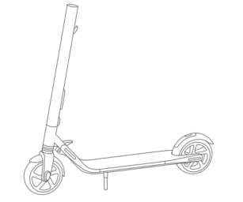
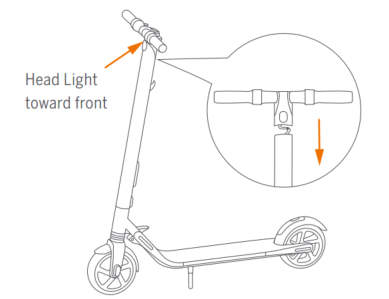
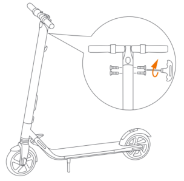
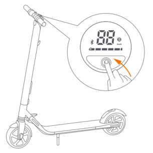

Assembling KickScooter
================================

1. Unfold the stem and push it until you hear a click. Then unfold the kickstand to support the scooter.

2.  Firmly connect the wires inside the handle and the stem. Slide the handle onto the stem. Be aware of the correct orientation.

3. Install four screws (two on each side) with the included hex wrench.

4. Verify that your KickScooter powers on and off.

