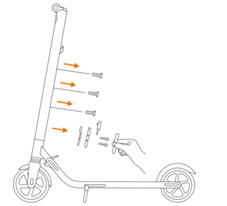
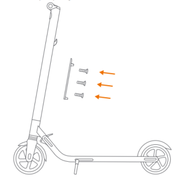
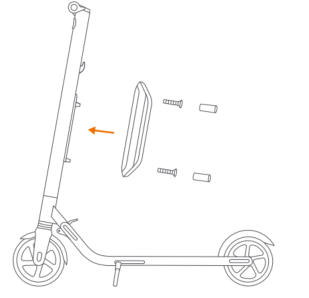
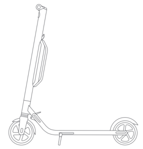

Installing a Second Battery Pack
==================================================

Warning: please use the screws provided with this product only.

Follow these steps when installing a second battery pack:

1. Remove the three screws on the stem, as shown. Then remove the cover near the charge port.

2. Install the rail with the M4 (10mm) screws (3 pcs), provided with this product. Please make sure it is properly fixed.

3. Install the external battery on the rail and fix it with the M4 (20mm) screws (2 pcs), provided with this product. After they are properly installed, block the screw holes with the rubber stopper.

4.  Verify that your KickScooter powers on and off.

